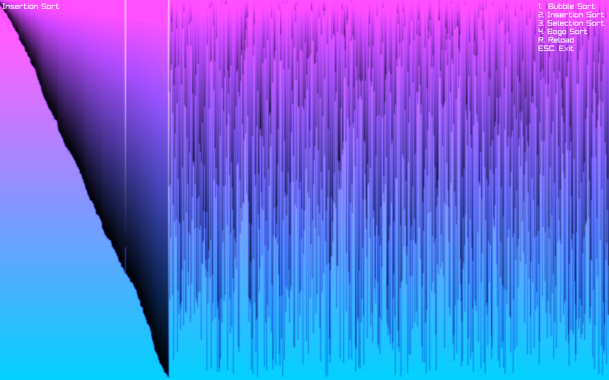
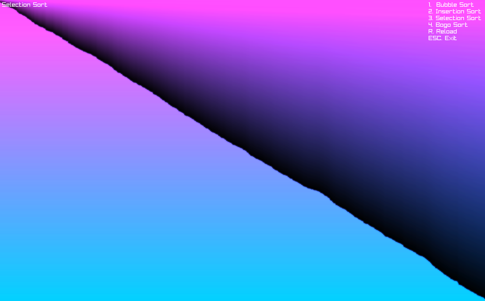
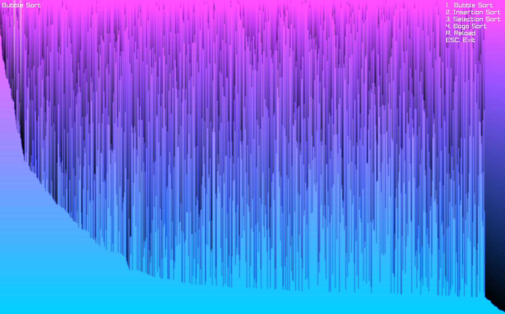

# Sorting Visualizer

Visualization of several popular sorting algorithms using [raylib](https://www.raylib.com/)

<p>



</p>
 
## Supported Algorithms

- **Bubble Sort**
- **Insertion Sort**
- **Selection Sort**
- **Bogo Sort**

## Controls

| Key       | Action                     |
|-----------|----------------------------|
| `1`       | Bubble Sort                |
| `2`       | Insertion Sort             |
| `3`       | Selection Sort             |
| `4`       | Bogo Sort                  |
| `R`       | Reset / Regenerate array   |
| `ESC`     | Exit program               |

## Build

### Requirements

- GCC
- [Raylib](https://github.com/raysan5/raylib)

For customization you can edit ```src/constants.h``` as you like

Run
 ```bat
./compile.bat
```

 or

```shell
./compile.sh
```
